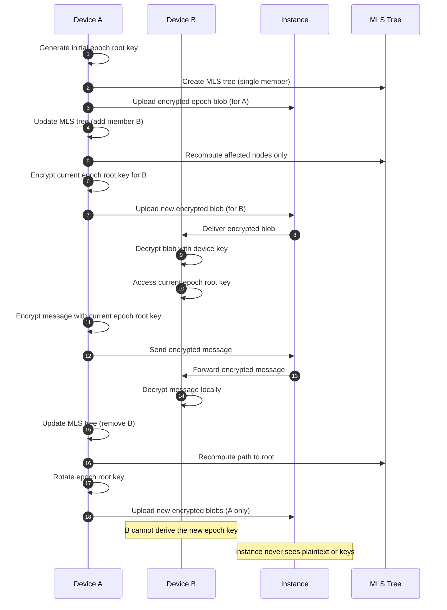

# Protocol Draft — Channels, Access & Messages

This document explains **how access to messages works** in a channel:
- how a channel is created
- how messages are sent and read
- how users gain or lose access
- how history remains accessible
- how scalability is preserved

This is a **conceptual protocol**, not an algorithmic specification.

---

## 0. Mental Model

A **channel** is a *cryptographic group*.

Access to messages is not enforced by the instance reading content,
but by **possession of the right cryptographic material**.

> If a device can derive the channel root key for the current epoch,
> it can read and send messages.

---

## 1. What Is a Channel (Conceptually)

A channel is defined by:

- a **group of identities**
- a **key tree** (shared structure)
- a sequence of **epochs**
- a stream of **encrypted messages**

The instance knows:
- which identities are members
- which devices belong to those identities
- which devices should receive blobs

The instance does **not** know:
- message contents
- channel keys
- epoch secrets

---

## 2. Channel Creation

### Purpose
Create a secure communication space between 2 or more users.

### Flow

1. A client initiates channel creation.
2. The client:
   - defines the initial member list
   - creates an initial **group key structure (tree)**
   - generates the **first epoch**
3. The instance receives:
   - channel identifier
   - membership list (identities)
   - encrypted blobs for initial devices
4. The channel becomes active.

### Important Notes

- Channel creation is **client-driven**
- The instance only stores structure + blobs
- The initial epoch defines access to the entire history from the start

---

## 3. The Key Tree (High-Level)

The channel uses a **tree-based group structure** (MLS-style):

- Leaves = devices
- Intermediate nodes = shared secrets
- Root = channel encryption key for the current epoch

Key properties:

- Devices in the same subtree share intermediate secrets
- Only affected branches change when membership changes
- Tree depth scales logarithmically with group size

This allows:
- efficient rekeying
- scalable access control
- minimal data redistribution

---

## 4. Epochs (Why They Exist)

An **epoch** represents a *version* of the channel membership.

A new epoch is created when:
- a user is removed
- a device is revoked

Each epoch has:
- a new root key
- new blobs for authorized devices

Old epochs remain stored but inaccessible without keys.

---

## 5. Sending a Message

### Purpose
Send a message to all authorized members of the channel.

### Flow

1. Device derives the **current epoch root key**.
2. Device encrypts the message using that root.
3. Encrypted message is sent to the instance.
4. Instance:
   - verifies sender has access
   - stores and forwards the encrypted payload

### Key Point

- The instance does not need to understand the message
- Authorization is structural, not semantic

---

## 6. Reading Messages (Including History)

### Purpose
Allow a device to read past and future messages it is authorized for.

### Flow

1. Device receives encrypted messages + blobs.
2. Device:
   - decrypts blobs using its device key
   - derives the epoch root key
3. Messages are decrypted locally.

### History Access Rule

> Access to history is equivalent to possession of the epoch keys.

This means:
- Joining a channel later still allows full history access
- As long as blobs for past epochs are provided

---

## 7. Adding a User to a Channel

### Purpose
Grant access to future and past messages.

### Flow

1. Existing member initiates addition.
2. New blobs are generated for:
   - all devices of the new user
3. Instance distributes blobs.

### Result

- New user can:
  - derive the new root key
  - read all messages (past + future)
- Existing users are unaffected (same keys, same access)

---

## 8. Removing a User from a Channel

### Purpose
Permanently revoke access.

### Flow

1. Removal is initiated by an authorized member.
2. A **new epoch** is created.
3. The tree is updated:
   - branches containing the removed user are replaced
4. New blobs are generated **excluding the removed user**.
5. Instance distributes blobs only to remaining devices.

### Security Guarantee

- Removed users:
  - cannot derive the new root key
  - cannot read future messages
- Past messages remain encrypted but useless without keys

---

## 9. Why This Scales

Without a tree:
- Every membership change requires re-encryption for every user

With a tree:
- Only **O(log N)** nodes change
- Only affected subtrees receive new blobs
- Large channels remain efficient

This makes:
- 2-user chats
- 10k+ member channels

use the **same protocol**, only different sizes.

---

## 10. Instance Responsibilities (Clarified)

The instance:

- stores encrypted messages
- stores encrypted blobs
- enforces membership rules
- routes data to correct devices

The instance does **not**:
- decrypt messages
- generate keys
- decide cryptographic access

> The instance is blind to content, not to rules.

---

## 11. Sequence Diagram — Message & Membership Flow

