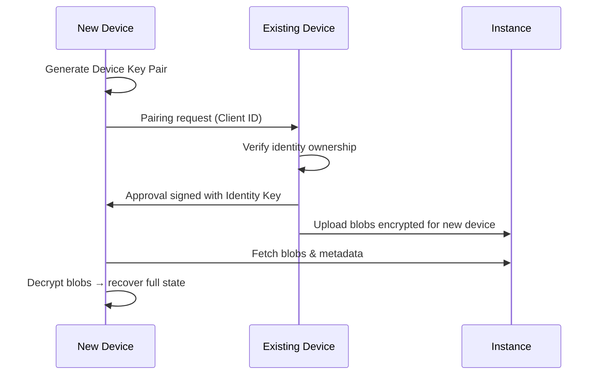

# Protocol Draft — Client & Device Management

This document describes the core protocol flows for **client creation**, **instance connection**, and **multi-device management**.
It focuses on *what exists*, *why it exists*, and *how data flows*, without defining cryptographic algorithms.

---

## 0. Identity Model Overview

This system distinguishes **who the user is** from **where the user is connected from**.

### Two distinct cryptographic roles exist:

| Element | What it represents | What it is used for |
|------|------------------|-------------------|
| **Identity Key (User Key)** | The *person* | Proving ownership, authorizing devices, signing trust decisions |
| **Device Key** | A *specific device* | Decrypting data, sending messages, participating in channels |

👉 **Identity keys grant authority**  
👉 **Device keys grant access**

This separation enables:
- multi-device usage
- device revocation without identity loss
- instance independence

---

## 1. Client Creation (Local)

### Purpose
Create a **global user identity** and the **first device** — without contacting any server.

### Elements generated

| Element | Purpose & Use |
|------|---------------|
| **Identity Key Pair** | Global, long-term identity. Used to approve new devices and sign trust decisions. Never shared with instances. |
| **Device Key Pair** | Unique per device. Used to decrypt blobs, derive channel keys, and sign messages. |
| **Client ID** | Logical identifier grouping all devices belonging to the same identity. |

### Flow

1. User installs the client.
2. Client generates:
   - Identity key pair
   - First device key pair
   - Client ID
3. All private material is stored locally and securely.
4. No instance is contacted.

### Example

> If you log in from a phone and a laptop:
> - Both share the **same identity key**
> - Each has its **own device key**

---

## 2. Connecting to an Instance

### Purpose
Attach the client to an instance **only when needed** (e.g. joining a server).

### Flow

1. Client joins a server hosted on an instance.
2. Instance registers:
   - Identity public key
   - Device public key
3. Instance responds with:
   - Server metadata (IDs, structure, permissions)
   - **Encrypted blobs for this device**
4. Client stores the instance reference locally.

### What the instance stores

- Public keys
- Encrypted blobs
- Server / channel structure
- Membership and permissions

🚫 The instance never stores:
- identity private keys
- device private keys
- decrypted messages
- channel keys

---

## 3. What Is a Blob (Concrete Meaning)

A **blob** is an encrypted package that allows a *specific device* to regain access to data.

A blob may contain:
- a channel root key
- an epoch key
- pointers to historical state

### Key rule

> **If a device can decrypt the blob, it can access the channel.**

Instances distribute blobs but **cannot open them**.

---

## 4. Adding a New Device (Full State Recovery)

### Purpose
Allow a new device to recover **all user state**, across **all instances**, transparently.

### High-level idea

- Identity approves the device
- Existing devices re-share access
- Instances remain blind relays

---

### Flow (Concrete)

1. New device generates its own device key pair.
2. New device requests pairing using:
   - Client ID
   - Identity public key
3. Existing device verifies and approves:
   - Signs approval with **identity key**
4. Existing device:
   - Re-encrypts **all relevant blobs** for the new device key
   - This includes:
     - all servers
     - all channels
     - all instances
5. New device connects to each instance and fetches:
   - its encrypted blobs
   - server metadata
6. New device decrypts blobs locally and reconstructs:
   - server list
   - channel access
   - full message history

### Result

> The new device becomes indistinguishable from existing ones.

---

## 5. Device vs Identity Key — Practical Example

### Scenario

- Alice uses Phone + Laptop
- Phone is stolen

### What happens

- Alice revokes the **phone device**
- New epochs are created
- New blobs are generated **only for remaining devices**
- Laptop continues working
- Phone can no longer decrypt anything

✅ Identity remains valid  
❌ Device access is permanently lost  

---

## 6. Key Concepts & Relationships

| Concept | Meaning |
|------|--------|
| **Identity Key** | Who you are |
| **Device Key** | Where you are |
| **Blob** | Proof of access |
| **Epoch / Root Key** | Time-bound channel secret |
| **Instance** | Blind storage + rule enforcement |

---

## 7. Security Principles

- Identity keys never leave the client
- Device keys are revocable
- Instances enforce **rules**, not **secrets**
- All meaningful access requires decryption capability
- History access is equivalent to key possession

---

## 8. Sequence Diagram — Adding a New Device

