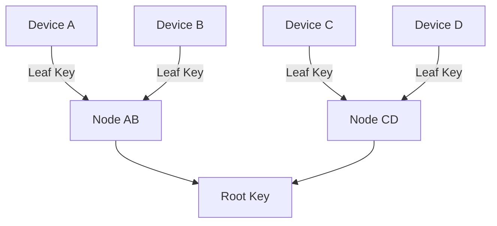
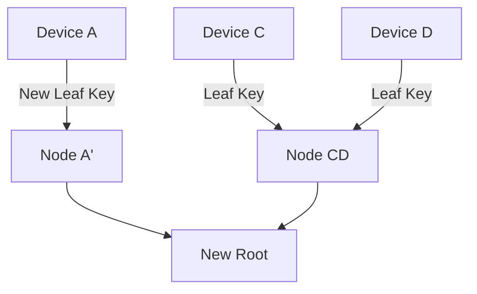

# Messaging Layer Security (MLS) — Conceptual Overview

This document explains **Messaging Layer Security (MLS)** as used in this project.
It focuses on **concepts, data structures, and flows**, not on cryptographic algorithms.
The goal is to make MLS *mentally visualizable* and concrete.

---

## 1. What MLS Is (High-Level)

MLS is a **group key management protocol** designed to:

- Encrypt messages for **N participants** efficiently
- Allow **adding/removing members** without re-encrypting everything
- Ensure **forward secrecy** and **post-compromise safety**
- Scale to **large groups (thousands of members)**

MLS does **not** define:
- message formats
- transports
- servers

It defines:
- **how keys are derived, shared, rotated, and revoked** inside a group

---

## 2. Core Objects (Concrete Definitions)

### 2.1 Keys

A **key** is a cryptographic secret used for exactly one role.

| Key Type | What it does | Who has it |
|--------|-------------|------------|
| Identity Key | Proves *who you are* | User |
| Device Key | Proves *this device* | Device |
| Leaf Key | Entry point into the group tree | Device |
| Node Key | Intermediate secret in the tree | Derived |
| Root Key | Encrypts messages | Group members |

Important rule:  
➡ **Keys are not reused for different roles**

---

### 2.2 Blobs (Very Important)

A **blob** is **encrypted data stored on the instance**.

Concretely, a blob contains:
- an encrypted **key**
- encrypted *for a specific recipient or subtree*

Example:
- “This blob contains `NodeKey(3)` encrypted for Device A”

The instance:
- stores blobs
- distributes blobs
- **cannot decrypt blobs**

---

### 2.3 Epoch

An **epoch** represents a **version of group membership**.

An epoch defines:
- who is allowed to read messages
- which keys are valid
- which tree structure is active

In Clef, **any change to group membership triggers a new epoch**.

This includes:
- adding a user
- removing a user
- adding a device
- revoking a device

An epoch therefore represents an **exact snapshot of authorized membership**.

---

## 3. The MLS Tree (Key Schedule Tree)

MLS uses a **binary tree** to derive keys efficiently.

### 3.1 Tree Structure

Each **leaf** = one device  
Each **parent node** = derived secret  
The **root** = group encryption key

Example (4 devices):
```
    RootKey
      |
   NodeABCD
    /    \
 NodeAB  NodeCD
  /  \    /  \
 A    B  C    D
```

- A, B, C, D = devices
- NodeAB = shared secret of A & B
- RootKey = shared by everyone

---

### 3.2 What Is Stored Where?

| Element | Stored where |
|------|--------------|
| Tree structure | Instance (public) |
| Blobs | Instance |
| Private keys | Devices only |
| Derived secrets | Devices only |

The instance **never** stores:
- plaintext keys
- root keys
- message keys

---

## 4. How a Device Accesses Messages

### 4.1 Concrete Decryption Path

A device:
1. Starts with **its Leaf Private Key**
2. Decrypts a blob → gets Parent Node Key
3. Uses that key to decrypt next blob
4. Repeats until reaching Root Key

This is **key derivation**

```
    Device Key
        ↓
   decrypt(blob_A)
        ↓
    NodeAB Key
        ↓
   decrypt(blob_AB)
        ↓
    Root Key
        ↓
   decrypt messages
```

---

### 4.2 Why This Scales

If 10,000 users exist:
- You do **not** encrypt the Root Key 10,000 times
- You encrypt **per subtree**

Each blob is shared by:
- many devices
- as long as they share that subtree

---

## 5. Adding a User (Epoch Change Required)

### 5.1 What Happens Conceptually

- A new leaf is added to the tree
- A **new epoch is created**
- A **new Root Key is derived**
- New blobs are generated **only for authorized devices**

The newly added user receives:
- blobs for the new epoch
- blobs for previous epochs **only if explicitly authorized**

They can now derive:
- past root keys
- current root key
- future keys until revoked

---

## 6. Removing a User (Epoch Change Required)

Removing a user follows the same epoch rotation mechanism as adding one,
but with a different authorization outcome.

### 6.1 What Must Change

When a user/device is revoked:
- Tree is **updated**
- All keys on the **path to the root** are rotated
- New Root Key is derived
- New epoch begins

Revoked members:
- cannot derive new node keys
- cannot compute new root
- cannot decrypt future messages

---

### 6.2 What Is Recomputed (Precisely)

Only:
- the revoked leaf
- its parent nodes
- the root

Everything else stays untouched.

---

## 7. MLS Update Visualization (Mermaid)



After removing B:



Only the **affected path** changes.

---

## 8. Mental Model Summary

Think of MLS as:

- A **shared safe**
- With **nested lockboxes**
- Each user has keys for *some* lockboxes
- To open the final safe, you open boxes upward
- Removing someone means **changing only the locks they touched**

---

## 9. Why MLS Fits This Project

MLS provides:
- scalability (log N operations)
- clean revocation
- instance blindness
- multi-device support
- formal security properties

And with the adapted rule:
- **joins do not rotate epochs**
- **revocations do**

…it fits a federated, history-preserving, privacy-first system.
